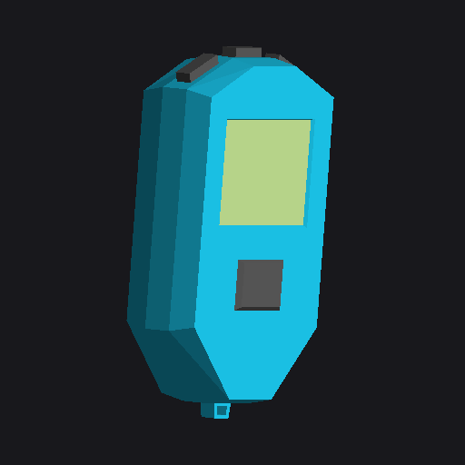

# Besiege Timer Plus



One block that is up to thirty-two timer blocks, in
[Besiege](https://store.steampowered.com/app/346010/Besiege/).

A sequence of anything — a bomb run, a launch, a set of doors — is normally a row
of timer blocks on the machine and a row of separate mappers to set them in. This
is one block with a **table** in it. Each row is a whole timer — wait, duration,
hold to run, allow stop, loop, and the key it presses — started by the block's own
key, and a button at the bottom turns the table into that many real timer blocks
when you want them.

Every row is a reproduction of Besiege's own timer, read out of the game: same
phases, same 50 Hz tick, same rounding. A row fires on the tick a real timer
beside it would, and the block's display flashes red each time one does — full red
on the tick it fires, faded out a tenth of a second later — so a sequence can be
watched as well as timed, and rows firing one after another read as separate
flashes.

**[UI Factory](https://steamcommunity.com/sharedfiles/filedetails/?id=2913469777)**
(another Besiege mod which enables the nice UI, see workshop item `2913469777`) is
optional here. With it the block gets the table docked under the block mapper;
without it the rows appear in Besiege's ordinary mapper and everything still
works.

<br clear="right">

## Install

Either subscribe to the mod on Steam, or if you don't use Steam you can clone the repo then:

```sh
./tools/install.sh              # symlink into Besiege_Data/Mods
./tools/install.sh --copy       # copy instead
./tools/install.sh --uninstall
```

Set `BESIEGE_DIR` if your install isn't found automatically. Start Besiege, enable
**Timer Plus** in the mods menu, and the block appears in the toolbar — search
`timer`. No C# toolchain is needed; the build uses Besiege's own compiler.

## The table

Click the block. Besiege's own mapper holds the block's activation key and its
Automatic switch, the way any block's does, and the table is docked underneath.

```
  ┌ Besiege's mapper ─────────────────────────────┐
  │                 ACTIVATE (...)                │
  │                       B                       │
  │                   AUTOMATIC                   │
  └───────────────────────────────────────────────┘
  ┌ the table ────────────────────────────────────┐
  │   │ WAIT │ DURATION │ ↧ │ ⏸ │ ↻ │   EMULATE   │
  │ 1 │ 0.5  │   0.2    │ · │ · │ · │   (...)  a  │
  │ X │ 1.2  │    1     │ · │ · │ ● │  (x)  fire  │
  │ 3 │  3   │   0.5    │ ● │ · │ · │   (...)  b  │
  │ ───────────────────────────────────────────── │
  │                       +                       │
  │ ───────────────────────────────────────────── │
  │            CONVERT TO TIMER BLOCKS            │
  └───────────────────────────────────────────────┘
```

`(...)` and `(x)` are the two speech bubbles Besiege's own key selector uses; see
[Keys and variables](#keys-and-variables) below. The three switch columns are
headed with a picture apiece — `↧` `⏸` `↻` above stand in for them. Row 2 is drawn
with the pointer on its number, which is what deleting a row looks like.

**ACTIVATE**, in the mapper above, is the block's own key, and it starts every row
in the table. **Automatic** starts them with the simulation instead.

| Column | What it does |
| --- | --- |
| (the number) | Which timer this is, numbered by wait — 1 fires first, whatever order the rows are in. Point anywhere on the row and it turns into a red **X**: click to delete that row |
| **WAIT** | Seconds from the start to the press |
| **DURATION** | How long the press is held |
| ↧ | Hold to run: the activation becomes a switch rather than a trigger |
| ⏸ | Allow stop: a second press stops a run in progress |
| ↻ | Loop: start again as soon as a cycle ends |
| **EMULATE** | The key or variable this row presses |

Column headings say what they are on hover, fading in under the heading the way
the game's own tooltips do — which is where the three switch columns give their
names in words. Nothing else carries a tip: a table whose every cell explains
itself is a table you cannot read across.

**+** adds a row. It copies the one above and pushes the wait on by the same gap
as the last two, so a sequence being typed in carries on. A block keeps at least
one row, so the last one will not delete.

Ten rows are shown at once; past that the table scrolls, and adding or deleting a
row leaves the view where it was. **+** and **CONVERT TO TIMER BLOCKS** do not
scroll with the rows — they sit along the bottom of the window and stay there,
because a table long enough to scroll is exactly when they are wanted. Anything the
panel has to say — a block already holding all thirty-two rows, a convert that
failed — is said on the button it is about, in red, for a few seconds.

The table is drawn at the mapper's own width, so the two are one window with a
seam across it.

**WAIT** and **DURATION** are dragged as well as typed. Which way the drag leaves
the box decides what it does:

| Drag | What happens |
| --- | --- |
| stays inside the box | selects text, the way any box does |
| out of the **side** | the value follows the pointer |
| out of the **top or bottom** | reaches up or down the column, lighting every row between where it started and where it is |

A reach that lights several rows leaves them selected and hands the keyboard to the
box it started from: type a number and every lit row takes it. Drag one of them
sideways instead and they all move by the same amount, keeping the spacing between
them. Touching any other cell drops the selection.

Reaching past the top or the bottom of the list scrolls it, so a selection can be
longer than the window. Click for a caret, double-click for the lot.

Sliders are clipped but out-of-range values can be typed.

| Setting | Slider | Typed |
| --- | --- | --- |
| Wait | 0–60 s | any |
| Duration | 0–60 s | any |

An event four minutes in is one row with `240`, exactly as it is one timer block
with `wait=240`.

## Keys and variables

The bubble beside a key cell is the same one Besiege's own key selector uses: a
bubble with **three dots** while the cell is on the keyboard, and clicking it hands
the cell to a variable; a bubble with a **cross** while a variable holds it, and
clicking takes it back.

In key mode, click the plate and press the key you want — a mouse button counts as
a key — or `Escape` to unbind it.

In variable mode the cell offers every variable name already in use anywhere on the
machine, eight at a time with a scrollbar past that, so wiring one block to another
is picking the name rather than spelling it. A name nobody has used yet is typed
straight into the box. Several names separated by `;` all work.

## Sorting

Click **WAIT** or **DURATION** to sort by it, and again to reverse; a triangle on
the heading says which way. The sort is
stable, so sorting by duration and then by wait gives wait order within duration,
and two rows that tie keep the order you put them in.

Those two are the only columns that sort. Three ticks in a column of thirty-two
rows are read off faster than a sort is clicked, and a table in keycode-name order
answers a question nobody asks.

## Logic Gate Plus

The same table, for Besiege's logic gate. A row is a whole gate:

| Column | What it does |
| --- | --- |
| (the number) | Which row this is. Point anywhere on the row and it turns into a red **X**: click to delete it |
| **INPUT A** | The gate's first input, a key or a variable |
| **INPUT B** | Its second. Barred with diagonal stripes for a gate that reads only one — the key is still there and still saved, so a gate switched back finds what it was given |

| **GATE** | Which of the twelve: NOT, AND, OR, NOR, NAND, XOR, XNOR, RANDOM, SR LATCH, D LATCH, COUNTER, EDGE |
| **M** | The gate's one switch: **I** for the edge detector's inverted, **T** for toggle mode, where a press flips an input rather than holding it. Barred and dead for the gates that have neither — random, both latches, the counter |
| **OUTPUT** | The key or variable the row presses while its gate says yes |

A block arrives holding three rows rather than one blank one: an AND on **J** and
**I** answering to `var_1`, a XOR in toggle mode on **K** and **O** pressing **P**,
and a counter on **L** and **M** answering to `var_2`. It is a circuit to read
rather than a form to fill in, and the board opens on it.

Besiege's own block has two switches and shows one at a time, which is why the
table has one column for both. Sorting is on **GATE** alone. Only the **M** column carries a tip; the rest say
what they are.

Every gate is Besiege's own, read out of the game: the seven combinational ones,
the two latches, the counter that divides by four, the random gate and the edge
detector that answers for exactly one tick. **CONVERT TO LOGIC GATES** builds one
of the game's logic gate blocks per row, pinned the same way.

One deliberate difference: no burnout. Besiege can burn a gate out for pulsing too
fast, because a gate is a thing on the machine that can be broken; a row of a table
is not one.

## The node editor

The same rows, seen as a circuit. **NODE EDITOR**, between PIN BLOCKS and the
convert button, opens a window of its own — not docked to the mapper, so it stays
up while you work on the machine.

Inputs and outputs are worked out from the rows themselves: a key or a name a row
reads that nothing on the board produces is an input, and one a row presses that
nothing reads is an output. That happens when the board is opened and when the
table changes underneath it — not while you are wiring. A key typed into a node on
the board is you wiring by hand, and answering it with a node you did not ask for
is the board arguing with you.

A gate node *is* a row of the table, and a wire *is* a row's input carrying the
name another row's answer goes out under. So the two are never out of step:
wire two gates together on the board and the table shows the variable; type that
variable into the table and the wire appears on the board.

| Node | What it is |
| --- | --- |
| **INPUT** | A key or a variable coming in. Wire it to as many gates as you like |
| a gate | One row: its symbol, its switch where the gate has one, and what its answer goes out on — a key or a variable, switched the same way the two ends are |
| **OUTPUT** | A key or a variable the answer also goes out on |
| a comment | A note on the board, wired to nothing. Click in it and type; it grows as you type to fit what you write — the same small margin on all four sides — newlines included |

Along the top is a row of icons: an input, an output, a comment, and the twelve
gates in Besiege's own order, each drawn as the shape it is and named on hover. Click one to
place it, drag one onto the board to put it where you let go, or right-click the
board and pick from the same list — the node lands where you clicked.

The board pans by dragging its empty parts — or with the middle button anywhere,
node or no node — and zooms with the wheel, over a grid so
you can see where you are, and the window resizes by its corners — the pointer says
so when it is over one. The title bar carries the wire-style button (straight, curved, square), **TIDY**,
and the box for what generated wire names start with. TIDY lays the board out —
inputs down the left, outputs down the right, gates in columns by how far they are
from an input, each ordered to keep the wires from crossing, the columns evenly
spaced across and every one of them centred on the same line so a column of three and one of five read as one board. It
moves things and removes nothing: an end with no wires on it is one you are about
to wire, and the red cross is how a node goes. A board opened for the first time
arrives laid out the same way.

Retyping what an input or output stands for takes its wires with it: every gate on
the other end of one follows to the new key or variable, so renaming an end is a
rename and not a disconnection. With one exception — if the name you type is one
something else on the board already answers to, the wires stay where they are.
Moving them would land them on that node as well as this one, which is a wire
nobody drew.

Ports are circles drawn on the board itself, with nothing behind them: empty until
something is on them, filled once a wire lands. They answer to more of the board
than they draw, so a wire is something to grab rather than something to aim at. Pull a wire from one port to another, either
direction, or click one then the other. A click on a port never takes a wire off — that is a drag, and the wire has to
come at least its own width off the port before it lets go, so a click that wobbles
changes nothing. A port that holds one wire hands it over when you drag it: the
wire comes off there and then, its loose end follows the
pointer in the live colour, and where you let go decides — on another port it goes
there, on nothing it stays off. A port that feeds several is a different question,
so dragging out of one only takes a wire with you while you follow that wire; stray
off it and you are drawing a new one, and letting go of a new one over nothing
leaves the board exactly as it was. An input takes one wire and an answer feeds as many as you like, which is
what a gate can mean.

The box in the title bar is what generated wire names start with. A block takes its
own number the first time it is opened — `ne01_` for the first Logic Gate Plus on
the machine, `ne02_` for the next — so its wires are `ne01_01`, `ne01_02`, and two
blocks never generate the same name. Type over it and new wires start with whatever
you typed. Names already given are left alone: a wire name is machine-wide, and
something else may be reading it.

The editor opens with the block: selecting a Logic Gate Plus brings up its table
and its board together, because they are the same circuit written two ways.
**NODE EDITOR** on the table stays lit while the editor is up, and closes it when
clicked again. So do Escape, Tab, and opening any of the game's own menus.

The pin in the title bar decides what happens when the block's menu closes. White
— out — and the board belongs to that menu and goes with it. Click it red and the
board is held up while you work on the rest of the machine; click it white again
with the menu already closed and the board goes too, since the pin was the only
thing holding it.

Hold control and a node under the pointer wears a faint dashed edge: that click
picks it out, or puts it back if it was already picked. Nothing else on the node
answers while control is down — not its key, not its switch, not its cross. Shift
and drag a box to pick out everything it catches — each node wears the faint edge
as the box reaches it, so you can see what you are about to take; hold control as
well and the box works on what is already picked, taking in what was out and
putting out what was in. Picked nodes wear a dashed white edge and drag together — moving one moves the
set — and holding control during a drag runs it along one axis from where it
started, whichever way it has gone furthest. A click on the empty board puts the
selection down. Copy them and they follow the pointer as ghosts
until you paste them down, keeping the shape they had. A wire is copied when both
of its ends were: wires between copied gates are reproduced under fresh names, and
a wire to something left behind is not copied — the pasted gate arrives with that
input free rather than quietly wired into the circuit it came from. A copied input
or output comes with the copy; where its key or name is already answered to on the
board it is given one of its own, so the copy is a circuit of its own rather than a
second set of wires on the original's ends. What was copied stays copied, so the
same thing can be laid down more than once.

**UNDO** and **REDO** in the title bar step Besiege's own undo, which every edit
here is filed in — one step per edit, carrying the whole block, so an undo puts
every gate back where it was with the wires it had.

The four hotkeys are declared in the mod's manifest, so they appear in Besiege's
controls screen and can be rebound like any other. They default to 1+C, 1+V, 1+Z
and 1+Y — the 1 key rather than Control, because Besiege's own copy, paste, undo
and redo are on Ctrl and the game hears the keyboard at the same time this does.

## Converting

**CONVERT TO TIMER BLOCKS** builds one of Besiege's own timer blocks per row, lays
them out on a horizontal plane beside this block, and hands them over as a
selection with the move tool up. One undo takes them all back.

**PIN BLOCKS**, beside it and on by default, drops one of the game's pins inside
each block it makes — nothing bound to its unpin key and its visuals hidden — so a
field of timers stays where it was put when the machine runs. Turn it off and the
blocks arrive loose.

They are laid out in the table's own numbering — first to fire at the top left,
then along and down — so the field reads the way the table does, whatever order the
rows happen to be sitting in.

The Timer Plus block stays where it is, so you can convert again or keep editing.
The panel closes as the timers arrive, because they become the selection and that
closes the block mapper it is docked to.

Each timer is set exactly as its row was, and every one gets the block's own
activation key, since a timer standing on its own has nothing to follow. If the
block was on **Automatic**, they get Besiege's own `automatic` instead.

This is Besiege's own additive load — the same path the load screen's "add to
machine" button runs — so joints, undo and the selection tool behave exactly as
they do for a machine loaded from a file.

## Notes

Two of Besiege's own rules apply to a row of this block exactly as they do to a
timer block, and are worth knowing:

**Two rows pressing the same key at the same time raise one press.** Besiege
reference-counts an emulated key, so the second to arrive is not an edge and the
key does not come up until the last one lets go. Leave a gap — sixty milliseconds
is below what anyone notices and above a fixed step.

**A row cannot press a key that starts this same block.** Besiege refuses that for
its own timer too, and for the same reason.

A block holds thirty-two rows and no more. That is not a round number picked for
neatness — see [AGENTS.md](AGENTS.md).

In multiplayer the rows run on the machine's owner and the presses reach everyone
else the way any block's emulation does.

Runtime behaviour hasn't been fully confirmed yet — if something misbehaves, the
details land in `Player.log` and in the in-game console with `show_logs true`.

AI agent? see [AGENTS.md](AGENTS.md) for layout, build, and any relevant info.
[docs/MODDING-NOTES.md](docs/MODDING-NOTES.md) has what this mod had to work out
about Besiege's modding API — including borrowing the mapper's own icons and
docking a UI Factory window under it. The general notes, for a mod that is not
this one, are collected in
[Besiege-Modding-AI-notes](https://github.com/anton-scholten/Besiege-Modding-AI-notes).

## Credits

The block model is Creative Commons Attribution (CC-BY 3.0), from Poly Pizza:

| Block | Model | By |
| --- | --- | --- |
| Timer Plus | [Timer](https://poly.pizza/m/0J1_OKm87pR) | Poly by Google |
| Logic Gate Plus | [Simple computer](https://poly.pizza/m/doMMnviJrGi) | Robert Schlyter |

They are fetched and converted by `tools/make-block-mesh.py` rather than
committed, so the licence stays with its source.

## Licence

GPL-3.0. Besiege is Spiderling Studios'; nothing of theirs is redistributed here.
