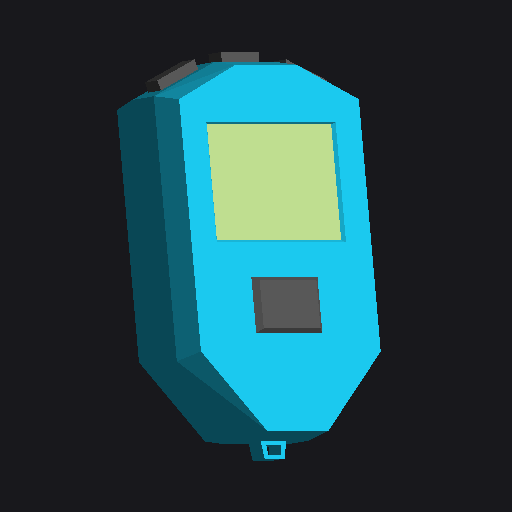
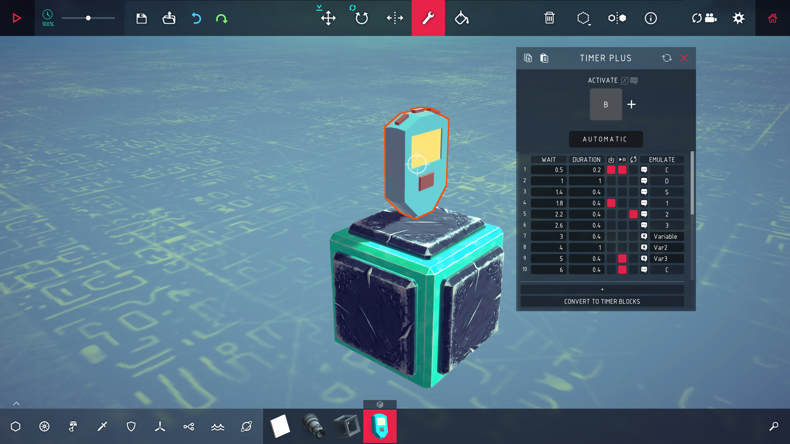
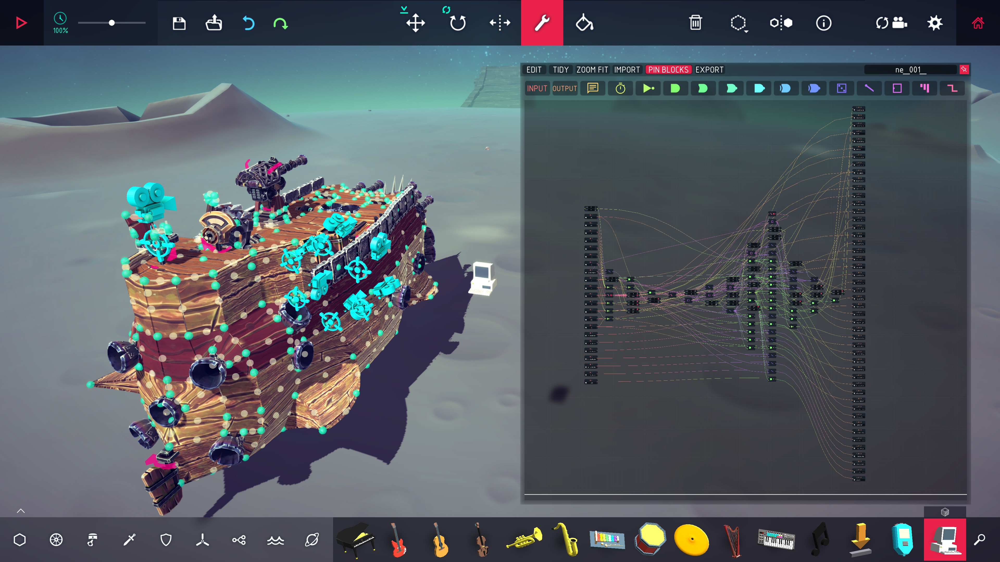
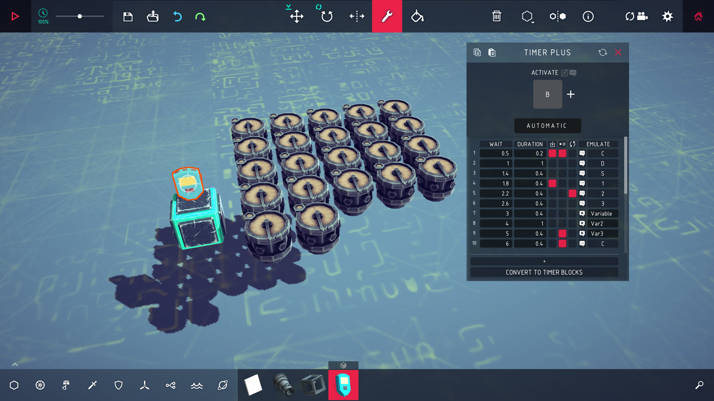
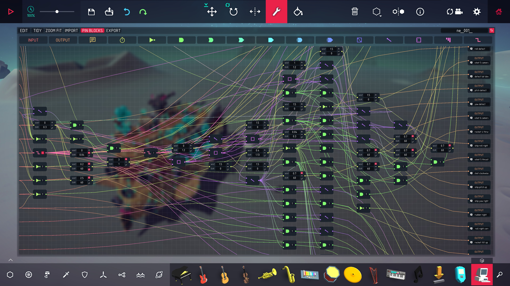
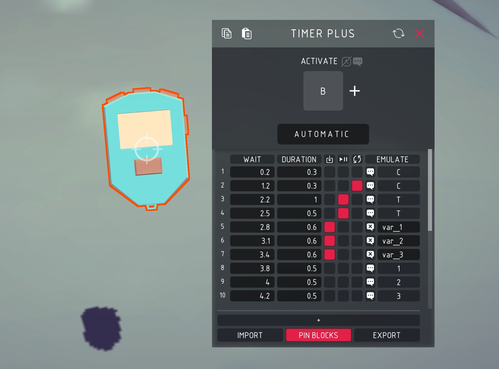
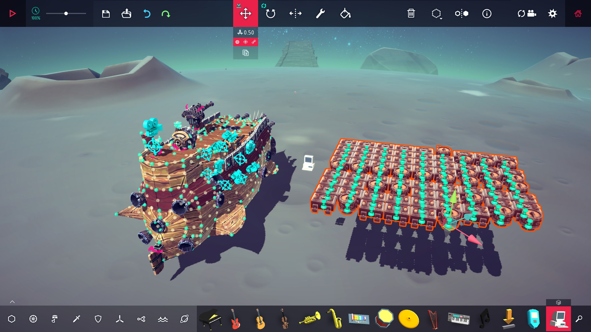
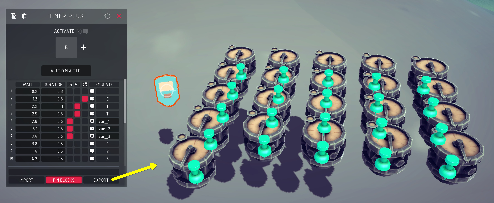

# Besiege Node Editor



A node editor for [Besiege](https://store.steampowered.com/app/346010/Besiege/) logic gates.
This makes it much faster and easier to build circuits and use variables.
Variables are created on the fly when connecting nodes (logic gates, timers, inputs/outputs) so you do not have to worry about it.
You can import existing logic gates and timers from your machine into the node editor, work inside of it, and export the node editor layout to Besiege logic gates and timers.

Access the node editor using the **Computer** block, or edit many timers at once with the **Timer Plus** block.

**[UI Factory](https://steamcommunity.com/sharedfiles/filedetails/?id=2913469777)** (workshop item `2913469777`) is needed for all UI.
Without it, the blocks should still run the logic but cannot be edited.

<br clear="right">

## Install

Either subscribe to the mod on Steam, or if you don't use Steam you can clone the repo then:

```sh
./tools/install.sh              # symlink into Besiege_Data/Mods
./tools/install.sh --copy       # copy instead
./tools/install.sh --uninstall
```

Set `BESIEGE_DIR` if your install isn't found automatically. Start Besiege, enable
**Node Editor** in the mods menu, and the blocks appear in the toolbar — search
`timer` or `logic`. No C# toolchain is needed; the build uses Besiege's own compiler.

## The Computer block



The block itself has a table where each row is a logic gate or a timer (up to 1024 rows):

| Column | What it does |
| --- | --- |
| (the number) | Hover the cursor over this and it turns into a red **X** to delete the row on click |
| **INPUT A** | First input for a gate, can be a key or a variable |
| **INPUT B** | Second input for gates with two input fields |
| **GATE** | Select the logic gate: NOT, AND, OR, NOR, NAND, XOR, XNOR, RANDOM, SR LATCH, D LATCH, COUNTER, EDGE |
| **M** | Modifier for logic gates that support it: **I** for the edge detector's inverted, **T** for toggle |
| **OUTPUT** | Key or variable emulated by the logic gate or timer |

## The node editor



The **NODE EDITOR** is not docked but can be pinned so it stays up while you work on the logic.
A node in the logic editor *is* a row in the previously introduced table, and a wire *is* a row's output connected to another row's output.

| Node | What it is |
| --- | --- |
| **INPUT** | A key or variable coming in. Wire it to as many gates as you like |
| a gate | Matches Besiege's logic gates. Its output goes out under an automatic hidden variable (such as `ne_001_004`) |
| a timer | Matches Besiege's timer. Has the **WAIT** and **DUR** values as well as the hold/stop/loop toggles. Its input starts it (if it has no input, the simulation starts it, just like a timer with the "Automatic" toggle selected) |
| **OUTPUT** | A key or variable going out |
| a comment | A resizable note (click to type, drag to move, drag the corner to resize) |

In the screenshot above, below the top menu from left to right: the input and output nodes, the comment, and the twelve logic gates in Besiege's order.
Click one to place it or drag it onto the board.
You can also right-click the board to show a drop-down list.
You can replace a node in the editor by dragging another one onto it.

### Colours and the board



The **EDIT** toggle shows additional options to select the color of each element, set the color modes (color/unicolor/random), resize the board, or snap the nodes to the grid among other things.

### Tidy



The **TIDY** button moves nodes around to help clean things and lay the logic out from left to right.

### Shortcuts and selection

Click a node to select it, control-click to add or remove another node.
Drag a box to select everything inside it.
Holding shift while using box select will add any additional node selected, holding control will add or remove depending on whether the individual node was already selected.
Pressing **delete** will remove all nodes selected.

Copy, paste and select all default to **1+C**, **1+V** and **1+A**.
A wire is copied when nodes it connects are copied.

## Timer Plus



| Column | What it does |
| --- | --- |
| (the number) | Order of the timer using the **WAIT** time. Mouse hover the number to show a red "X" to then click and delete that timer. |
| **WAIT** | Seconds from the start to the press |
| **DURATION** | How long the press is held |
| ↧ ⏸ ↻ | Toggles for the Besiege options: hold to run, allow stop, loop |
| **EMULATE** | The key or variable this timer row presses/emulates |

Every row is identical in function to Besiege's own timer: same phases, same 50 Hz tick, same rounding.

**+** copies the row above and pushes the wait on by the same gap as the last two.
Ten rows show in the screenshot.
**+** and the **IMPORT**, **PIN BLOCKS** and **EXPORT** buttons stay at the bottom.
Supports up to 1024 timers.

**WAIT** and **DURATION** support mouse drag as follows:

| Cursor location while dragging | What happens |
| --- | --- |
| stays inside the box | selects text |
| out of the **horizontal** | the value follows the pointer |
| out of the **vertical** | reaches up or down the column, lighting every row it passes for editing multiple timers at once |

The multi-select allows you to type a number and every selected row will take the same value, or drag the input sideways on one row and all will change by the same value.

Click the column headers **WAIT** or **DURATION** to sort the table of timers in ascending or descending order.

## Converting

**IMPORT** takes every logic gate and timer block on the machine and puts it in the node editor (or the timer plus block, it has the same feature for timer blocks only).
The blocks are removed from the machine when imported.

**EXPORT** takes all the nodes in the node editor (or the rows of the timer plus block) and converts them to Besiege timer and logic gate blocks.
You can enable or disable the **PIN BLOCKS** option to add a pin block inside the timers and logic gates when they are exported.
This uses Besiege's own additive load, so joints, undo and the selection tool behave exactly as they do for a machine loaded from a file.





## Other languages

The mod has basic translations for every language Besiege has, but they have not been verified so may not be correct.
Feel free to correct them in the `lang/*.txt` files (`\n` is a line break, `{0}` is a number the mod fills in).
The names of logic gates come from Besiege's own translations to match the rest of the game.

## Notes

Two of Besiege's own rules apply to this mod:
- **Two rows pressing the same key at once raise one press.** Besiege reference-counts an emulated key so the second is not an edge.
- **A row cannot press a key that starts its own block.** Besiege refuses that for its own timer too.

For performance, the rows are saved in their own data format so a long table opens as quickly as a short one.

AI agent? see [AGENTS.md](AGENTS.md) for layout, build, and any relevant info. [docs/MODDING-NOTES.md](docs/MODDING-NOTES.md) has what this mod had to work out about Besiege's modding API. The general notes, for a mod that is not this one, are collected in [Besiege-Modding-AI-notes](https://github.com/anton-scholten/Besiege-Modding-AI-notes).

## Credits

The block models are Creative Commons Attribution (CC-BY 3.0), from Poly Pizza:

| Block | Model | By |
| --- | --- | --- |
| Timer Plus | [Timer](https://poly.pizza/m/0J1_OKm87pR) | Poly by Google |
| Computer | [Simple computer](https://poly.pizza/m/doMMnviJrGi) | Robert Schlyter |

They are fetched and converted by `tools/make-block-mesh.py` rather than committed,
so the licence stays with its source.

## Licence

GPL-3.0. Besiege is Spiderling Studios'; nothing of theirs is redistributed here.
